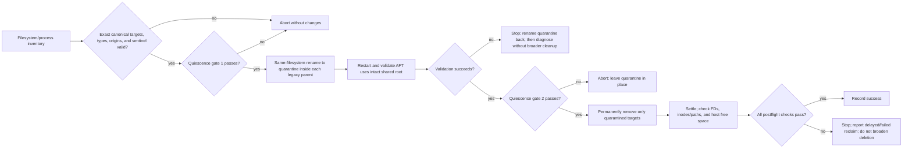

# Reclaim stale AFT index storage

## Overview

Reclaim approximately 23 GiB of obsolete AFT index data through a controlled,
offline, two-phase SAME-FILESYSTEM quarantine procedure. Preserve the active
shared AFT storage root, including its backups and checkpoints; do not change
OpenCode sessions, the OpenCode SQLite database, or current project indexes.
The first phase is reversible and does not reclaim space; permanent deletion
follows only after a successful restart validation proves that AFT uses the
intact shared root.

## Problem Frame

Historical AFT storage migrations left independent copies of the same large
project index in three locations. The current shared CortexKit root is active;
the legacy OpenCode root is marked as migrated, and the pre-migration cache
root has not changed since April. The copies are not hardlinked, so removing
only validated legacy index directories can recover host disk space.

The only documented legacy targets are:

- OpenCode legacy: `$HOME/.local/share/opencode/storage/plugin/aft/index`, whose
  legacy parent must carry `.migrated_to_cortexkit`.
- Pre-v0.10.1 cache: `$HOME/.cache/aft/index`, whose legacy parent must be the
  documented pre-migration AFT cache root.

### Target identity contract

For each target, resolve `$HOME`, record the absolute canonical path, inode,
filesystem device, entry type, and parent/origin metadata. Proceed only when
the canonical path matches exactly one of the two documented paths above, the
target is a directory named `index`, and its parent is the expected legacy
directory on the expected filesystem. Validate the OpenCode migration sentinel
for the OpenCode parent. A matching project hash is corroboration only and is
never authority; any ambiguity or mismatch aborts the operation.

## Requirements Trace

- R1. Offline preflight uses filesystem and process metadata only. Do not use
  `opencode-doctor`, which may auto-spawn OpenCode; an AFT diagnostic is allowed
  only when its installed behavior is proven non-spawning, otherwise use
  filesystem proof or abort.
- R2. Apply the per-target canonical-path, type, origin, filesystem, and
  sentinel identity gate. Matching project hashes are never authority.
- R3. Immediately before each mutation, prove quiescence: no OpenCode, Pi, or
  AFT process; no parent/supervisor restart risk; and no open file descriptor
  on a target. Inability to prove any condition is an abort.
- R4. In phase one, rename only the two validated legacy `index` directories to
  same-filesystem quarantine entries inside their own legacy parents.
- R5. Restart and validate AFT against the intact shared root before any final
  deletion. If restart validation fails, stop and rename quarantined targets
  back before further diagnosis; do not improvise broader cleanup.
- R6. In phase two, permanently remove only the successfully validated
  quarantined targets. Never delete whole roots, the current shared root,
  backups, or checkpoints.
- R7. Verify target inode/path disappearance and host free-space recovery after
  a settle interval and a no-open-FD check, accounting for delayed reclaim.

## Scope Boundaries

- In scope: a one-off, offline cleanup procedure for the two exact legacy AFT
  index targets, their same-filesystem quarantine entries, and a durable
  runbook describing the two phases.
- Out of scope: deleting current shared indexes, deduplicating indexes with
  symlinks or hardlinks, AFT upgrades, OpenCode session pruning, and event-table
  retention.
- Out of scope: deleting whole roots, `backups`, `checkpoints`, task state,
  logs, or configuration from any AFT root; creating a full duplicate backup
  of legacy indexes; or broader storage cleanup.

## Context & Research

### Relevant Code and Patterns

- `docs/opencode-doctor.md` documents that the doctor may spawn a temporary
  OpenCode server when none is running. It therefore cannot be an offline
  preflight authority for this cleanup.
- `docs/solutions/2026-06-25-opencode-sqlite-db-bloat-prune-vacuum.md` is the
  closest storage-maintenance precedent. It requires exclusive access and
  verifies actual reclaimed space rather than assuming deletion succeeded.
- `docs/solutions/2026-05-22-bun-sqlite-readonly-wal-pattern.md` reinforces
  read-only inspection of live state and failure on unsafe conditions.

### Observed Storage State

- The shared CortexKit AFT root is `$HOME/.local/share/cortexkit/aft`; it is
  used by active AFT v0.47.3 and contains recovery data.
- The legacy OpenCode target is
  `$HOME/.local/share/opencode/storage/plugin/aft/index`; its parent carries
  `.migrated_to_cortexkit` and has roughly 11.7 GiB of stale index data.
- The pre-v0.10.1 target is `$HOME/.cache/aft/index` and has roughly 11.3 GiB
  of stale index data.
- The largest index entry is a separate, non-hardlinked copy in all three
  roots. The shared copy remains the source of truth.

### External References

- [AFT v0.10.1 storage migration](https://github.com/cortexkit/aft/releases/tag/v0.10.1)
- [AFT architecture and storage ownership](https://github.com/cortexkit/aft/blob/main/ARCHITECTURE.md)
- [AFT migration implementation](https://github.com/cortexkit/aft/blob/main/packages/aft-bridge/src/migration.ts)
- [AFT CLI guidance](https://github.com/cortexkit/aft/blob/main/docs/cli.md)

## Key Technical Decisions

- **Use the installed AFT version for restart validation.** Do not fetch
  `latest` during maintenance; a version change could alter migration behavior
  mid-procedure.
- **Make identity path-based and per-target.** The resolved canonical path,
  directory type, expected parent/origin, filesystem, and required OpenCode
  sentinel authorize a target. A matching project hash alone never does.
- **Keep offline preflight non-spawning.** Use filesystem/process metadata;
  never rely on `opencode-doctor`. Use an AFT diagnostic only with proof that
  the installed diagnostic cannot spawn, otherwise abort or use filesystem
  evidence.
- **Quarantine before deletion on the same filesystem.** Rename only validated
  legacy `index` directories to reversible quarantine entries within their own
  parents. This does not reclaim space. Restart and validate the shared root,
  then quiesce again before permanent deletion.
- **Preserve the active shared root intact.** Never delete current indexes,
  whole roots, backups, or checkpoints; no full global rebuild is expected.
- **Do not create a full duplicate backup of legacy indexes.** They are
  regenerable, and copying them defeats the disk-recovery goal. Quarantine is
  the reversible safety mechanism.

## High-Level Technical Design

> This illustrates the intended approach and is directional guidance for review,
> not implementation specification. The implementing operator should treat it as
> safety context, not code to reproduce.

## Implementation Units

- [x] **Unit 1: Write the guarded maintenance runbook**

**Goal:** Document a repeatable, fail-closed procedure before any runtime data
is removed.

**Requirements:** R1–R7.

**Dependencies:** None.

**Files:**
- Create: `docs/runbooks/aft-legacy-index-cleanup.md`
- Reference: `docs/opencode-doctor.md`
- Reference: `docs/solutions/2026-06-25-opencode-sqlite-db-bloat-prune-vacuum.md`

**Approach:**
- Separate read-only inventory from the destructive phase.
- Document the two exact canonical target paths and the per-target identity
  record: path, inode, device, type, parent/origin, and sentinel state.
- Make offline preflight filesystem/process metadata only. Do not call
  `opencode-doctor`; use an AFT diagnostic only when its non-spawning behavior
  is proven, otherwise use filesystem proof or abort.
- Define two immediate-before-mutation quiescence gates covering processes,
  parent/supervisor restart risk, and open descriptors.
- Describe same-filesystem quarantine, restart validation, rollback of
  quarantine after a failed restart, final deletion, and delayed-reclaim
  postflight. Explicitly protect the shared root, whole roots, backups, and
  checkpoints.
- Define abort conditions for any identity mismatch, missing sentinel,
  uncertain quiescence, failed validation, or unproven diagnostic behavior.

**Test expectation:** none — documentation-only unit. Review the procedure
against the observed legacy and shared layouts before use.

**Verification:**
- A reviewer can identify the two exact targets, both quiescence gates, the
  rollback decision, and every protected path without inferring paths or
  deleting data.

- [ ] **Unit 2: Quarantine the validated legacy indexes**

**Goal:** Reversibly quarantine only validated stale indexes while preserving
shared AFT state. This phase does not reclaim space.

**Requirements:** R1–R4.

**Dependencies:** Unit 1 and explicit operator approval for quarantine.

**Files:**
- Modify: the two runtime legacy `index` directories only (not tracked
  repository files)
- Preserve: the shared AFT storage root and all non-index legacy metadata

**Approach:**
- Capture before-state: available host space; each target's canonical path,
  inode, device, type, parent/origin, size, and sentinel; installed AFT version;
  and shared-root backup/checkpoint presence.
- Immediately before each rename, revalidate the recorded target identity and
  repeat the hard quiescence gate. Require no OpenCode, Pi, or AFT process, no
  parent/supervisor restart risk, and no open descriptor on the target;
  inability to prove any condition aborts.
- Rename only each identity-validated `index` directory to a quarantine entry
  inside its own legacy parent on the same filesystem. Do not delete anything,
  move across filesystems, remove parent roots, or touch shared indexes,
  backups, or checkpoints.
- Abort rather than improvising if the observed layout differs from the
  documented layout.

**Test expectation:** none — controlled maintenance operation. The preflight
and postflight evidence is the behavioral verification.

**Verification:**
- The original paths are absent, each quarantine entry retains its recorded
  inode and device, legacy parents retain required metadata, and host free space
  has not been claimed as recovered.

- [ ] **Unit 3: Restart and validate the active storage path**

**Goal:** Prove that the current shared AFT root remains usable after quarantine.

**Requirements:** R2, R5.

**Dependencies:** Unit 2.

**Files:**
- Reference: `docs/runbooks/aft-legacy-index-cleanup.md`

**Approach:**
- Restart OpenCode normally and confirm AFT starts from the shared CortexKit
  storage path without migration, index, or schema errors while the quarantined
  copies remain intact.
- Compare operational health with the preflight snapshot; do not treat the
  unchanged host space as a failure because quarantine is reversible and does
  not reclaim space.
- After any failed post-quarantine restart, stop the processes and rename the
  quarantined targets back to their recorded original names before further
  diagnosis. Do not delete anything or improvise broader cleanup.

**Test expectation:** none — operational validation of an existing runtime.

**Verification:**
- AFT/OpenCode starts successfully from the shared root, current indexes remain
  available, protected backups/checkpoints remain present, and no unexpected
  cold global re-index is triggered. Only this success permits Unit 4.

- [ ] **Unit 4: Permanently remove quarantine and complete postflight**

**Goal:** Permanently remove only the quarantined legacy indexes after shared
root validation and prove actual reclaim.

**Requirements:** R3, R6, R7.

**Dependencies:** Unit 3 succeeds and explicit operator approval for deletion.

**Files:**
- Modify: the two recorded quarantine directories only (not tracked repository
  files)
- Preserve: all roots, the current shared root, backups, checkpoints, and
  non-index metadata

**Approach:**
- Quiesce again immediately before each permanent deletion. Require no
  OpenCode, Pi, or AFT process, no parent/supervisor restart risk, and no open
  descriptor on the quarantined target; inability to prove any condition
  aborts and leaves quarantine in place.
- Reapply the identity gate: each quarantine entry must still match its
  recorded inode, device, and legacy parent, and neither original canonical
  target path may have reappeared. Any mismatch aborts without deletion.
- Permanently remove only the quarantine entries whose recorded identity still
  matches. Never delete a whole root, the current shared root, backups, or
  checkpoints, and do not create a full duplicate index backup.
- After a settle interval, perform the no-open-FD check, verify the recorded
  inodes and both canonical paths are gone, then verify host free-space
  recovery. Account for delayed reclaim and do not claim success from path
  disappearance alone.

**Test expectation:** none — controlled maintenance operation. The identity,
quiescence, restart, rollback, and postflight evidence is the behavioral
verification.

**Verification:**
- Both quarantine entries and their recorded inodes are absent, both original
  canonical paths remain absent, no open descriptor retains deleted data, and
  free host space recovers after settling. Any delayed or missing reclaim is
  reported without broader deletion.

## System-Wide Impact

- **State lifecycle:** Legacy indexes are regenerable. Quarantine is reversible
  but does not reclaim space; permanent removal follows only successful shared-
  root validation. The shared root contains persistent AFT recovery and task
  state and is immutable for this procedure.
- **Failure handling:** Every uncertain identity, preflight, quiescence, or
  postflight result is an abort or stop, not a fallback to broader deletion.
  Failed post-quarantine restart requires rollback before further diagnosis.
- **Resource behavior:** Removing only legacy data should not trigger a full
  rebuild. Free-space accounting may lag deletion, so validate after settling;
  if recovery is not proven, stop without consuming more disk.
- **Unchanged invariants:** OpenCode sessions, `opencode.db`, Magic Context
  state, AFT backups/checkpoints, and active shared indexes remain untouched.

## Risks & Dependencies

| Risk | Mitigation |
|---|---|
| Active writer retains moved or deleted files | Repeat the hard quiescence gate immediately before each mutation; require no matching process, supervisor restart risk, or open descriptor. |
| A path or project hash identifies the wrong index | Require the exact canonical path, directory type, parent/origin, device, and OpenCode migration sentinel; hashes are never authority. |
| Offline diagnostic spawns OpenCode | Do not rely on `opencode-doctor`; use only filesystem/process metadata unless an AFT diagnostic is proven non-spawning, otherwise abort. |
| Parent or supervisor restarts a writer during maintenance | Treat any unproven parent/supervisor state as a quiescence failure and abort. |
| Restart unexpectedly needs quarantined data | Stop and rename quarantine back before further diagnosis; do not improvise broader cleanup. |
| Final deletion is mistaken for quarantine | Keep phase one reversible and space-neutral; permit phase two only after successful restart validation and a second quiescence gate. |
| Free space is not immediately visible | Wait for the settle interval, perform the no-open-FD check, verify inodes/paths, and account for delayed reclaim rather than claiming success from absence alone. |
| Rebuild consumes available disk | Never remove shared indexes; preserve the shared root, backups, and checkpoints, and stop if restart behavior is unexpected. |

## Documentation / Operational Notes

- The runbook is a manual, explicit-approval procedure. It must not be wired to
  a scheduled cleanup job.
- Record each target's canonical identity, before/after inode state, target
  sizes, quarantine state, restart validation, and host free space in the
  execution result. Wait for settling and do not claim recovery from directory
  disappearance alone.
- If restart validation fails, stop and restore quarantine before diagnosis. If
  postflight reclaim is delayed or unproven, report it without broader cleanup.
- Keep the AFT index cleanup separate from OpenCode DB event retention and
  session pruning.

## Sources & References

- `docs/opencode-doctor.md`
- `docs/solutions/2026-06-25-opencode-sqlite-db-bloat-prune-vacuum.md`
- `docs/solutions/2026-05-22-bun-sqlite-readonly-wal-pattern.md`
- [AFT v0.10.1 release](https://github.com/cortexkit/aft/releases/tag/v0.10.1)
- [AFT architecture](https://github.com/cortexkit/aft/blob/main/ARCHITECTURE.md)
